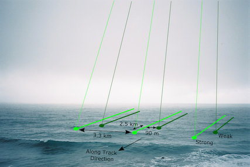

# ICESat-2 ATLAS $K_{d532}$ Tutorial
</img>
## Overview
Turbidity, the capacity of water to attenuate light, is an important metric in many fields of coastal ocean research and engineering. As a result, a number of techniques have been developed to measure the diffuse attenuation coefficient – a common metric for turbidity – both in situ and via remote sensing. On a global scale, turbidity is most commonly measured using passive satellite spectrometry. While these techniques have been shown to be reliable in many regions, they are not able to directly measure diffuse attenuation at depth and instead rely on the water leaving irradiance. In this study, we propose an active remote sensing method to measure the diffuse attenuation at 532nm ($K_{d532}$) using the Advance Topographic Laser Altimeter System (ATLAS) on board NASA’s Ice, Cloud, and land Elevation Satellite 2 (ICESat-2). This method, in contrast to previous studies, does not rely heavily on signal processing techniques such as deconvolution, but instead employs a Random Forest Regression model. The method is designed such that it can be deployed across a broad range of geographic locations, as opposed to a single site. Additionally, it is compatible with imagery-based Kd products, such that it can be seamlessly integrated with those products and used to fill in data gaps—especially close to shore. We tested this regression model against $K_{d532}$ measurements taken by the NOAA’s Visible Infrared Imaging Radiometer (VIIRS) and found that it scored an R2 of 0.67 ± 0.12 with a mean squared error of 0.34 ± 0.14 m-1, a mean absolute error of 0.31 ± 0.4 m-1 and a mean relative difference of 1.07±0.25. These accuracy metrics serve as a benchmark for future machine learning regression studies of turbidity using ICESat-2.
  
**Click [here](https://orst.library.ingentaconnect.com/content/asprs/pers/2021/00000087/00000011/art00011) for more information on the scientific and algorithmic background for this project.** 
   
*<u>Prefered Citation:</u>*
  
F. Corcoran and C. E. Parrish, “Diffuse Attenuation Coefficient ($K_{d}$) from ICESat-2 ATLAS Spaceborne Lidar Using Random-Forest Regression,” photogramm eng remote sensing, vol. 87, no. 11, pp. 831–840, Nov. 2021, doi: 10.14358/PERS.21-00013R2.
  
**Acknowledgements:**
  
Funding for this research was provided by NASA ROSES Grant
80NSSC20K0964, “ICESat-2 Bathymetric Studies, Product
Development and Data Validation,” and subaward UTA20-
000752 from Applied Research Laboratories, The University
of Texas at Austin, to Oregon State University. We gratefully
acknowledge the support of Lori Magruder, University
of Texas Principal Investigator and ICESat-2 Science Team
Lead.. We would also like to express our gratitude to the
research teams at OSU and UT Austin for ongoing collaboration
on ICESat-2 bathymetric mapping research and to David
Harding of NASA’s Goddard Space Flight Center for technical
input. Additionally, we are grateful for the helpful comments
of the three anonymous reviewers.
